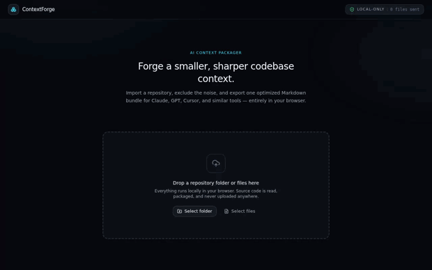
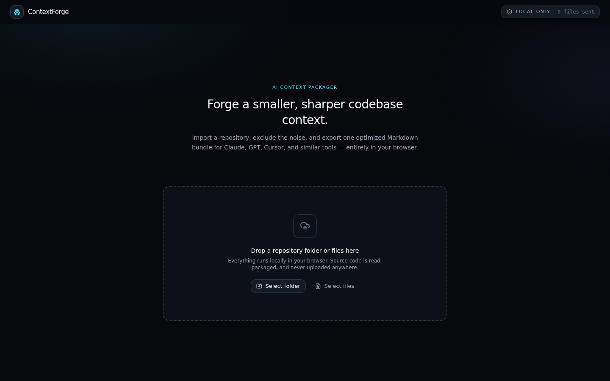
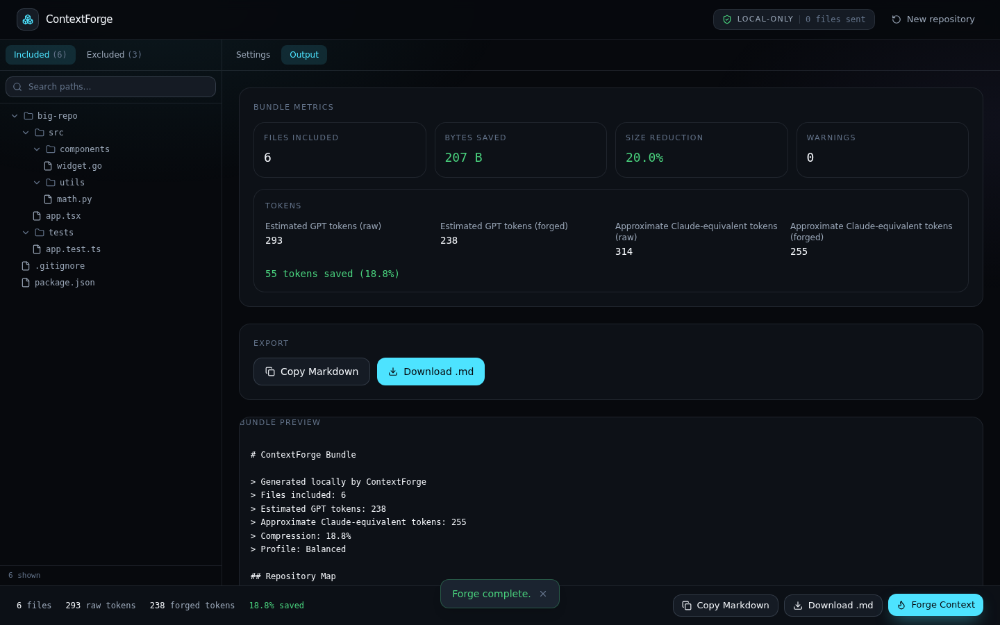
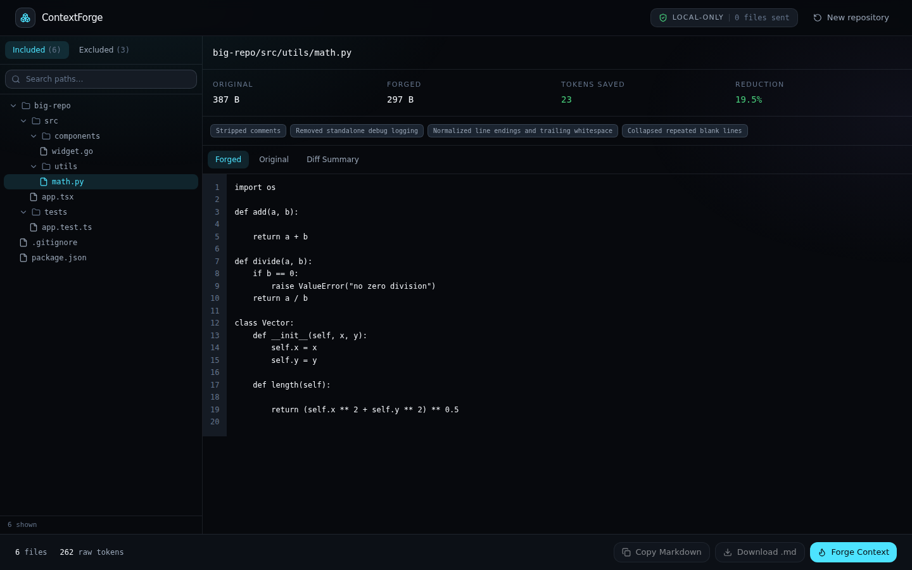
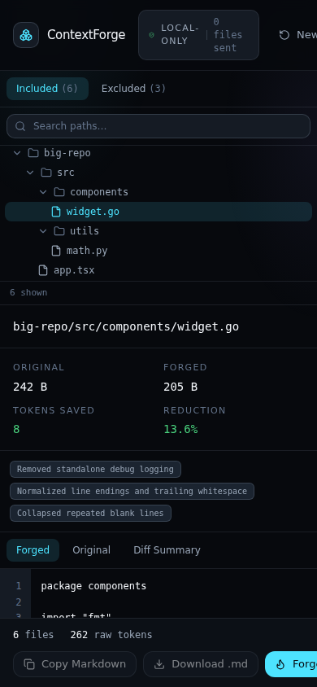

# ContextForge

**Author:** [anatolilavra-droid](https://github.com/anatolilavra-droid)

A local-first AI context packager for developers. Import a repository folder
or files, exclude low-signal noise, optionally compress eligible source
files with syntax-aware transforms, and export one optimized Markdown
context bundle for Claude, GPT, Cursor, and similar AI coding tools.

Everything — scanning, ignore-rule evaluation, syntax-aware transforms,
token estimation, and Markdown compilation — runs entirely in the browser.
Source code is never uploaded anywhere.

**Live demo:** https://anatolilavra-droid.github.io/-ContextForge-client/



## Screenshots

| Idle | Workspace |
| --- | --- |
|  |  |

| File detail (desktop) | File detail (mobile) |
| --- | --- |
|  |  |

## Stack

React, TypeScript, Vite, Tailwind CSS, `gpt-tokenizer` (local GPT-style
token counting), and `web-tree-sitter` (syntax-aware source transforms).
All repository scanning and transformation work happens in a dedicated
Web Worker so the UI thread stays responsive on large repositories.

## Getting started

```bash
npm install
npm run dev
```

Then open the printed local URL, drop a repository folder (or select
files/folders via the buttons), adjust the forge preset and settings, and
click **Forge Context**.

## Scripts

- `npm run dev` — start the Vite dev server
- `npm run build` — type-check and build for production
- `npm run preview` — preview the production build locally
- `npm run lint` — run oxlint

## How it works

1. **Intake** — files are collected via native drag-and-drop, the File
   System Access API (`showDirectoryPicker`), or `<input type="file"
   webkitdirectory>`, with relative paths reconstructed and sanitized.
2. **Scan** — a dedicated module worker (`src/worker/forge.worker.ts`)
   ingests files, sniffs for binary content, applies built-in ignore
   patterns plus `.gitignore` / `.contextforgeignore` / custom rules, and
   builds a repository tree with per-language stats.
3. **Forge** — for JavaScript, TypeScript, TSX, Python, Go, and Rust, the
   worker lazily loads a `web-tree-sitter` grammar and performs
   syntax-aware comment stripping, standalone debug-log removal, and
   (in Architecture/Maximum presets) function-body stubbing — never
   regex-based. JSON is compacted via `JSON.parse`/`JSON.stringify`;
   Markdown keeps fenced code blocks intact. Any parser/grammar failure
   falls back to safe, content-preserving normalization with a recorded
   warning.
4. **Export** — a deterministic Markdown bundle (repository map, per-file
   sources, optional excluded-file appendix) is compiled in the worker and
   can be copied to the clipboard or downloaded.

See `src/app/app-types.ts` and `src/worker/worker-protocol.ts` for the
shared domain types and the typed main-thread/worker message protocol.

## Deployment

Pushes to `main` build and deploy the app to GitHub Pages automatically
(see `.github/workflows/deploy.yml`). The production build sets `base` to
`/-ContextForge-client/` when `GITHUB_PAGES=true` so asset paths resolve
correctly under the project-page URL.
